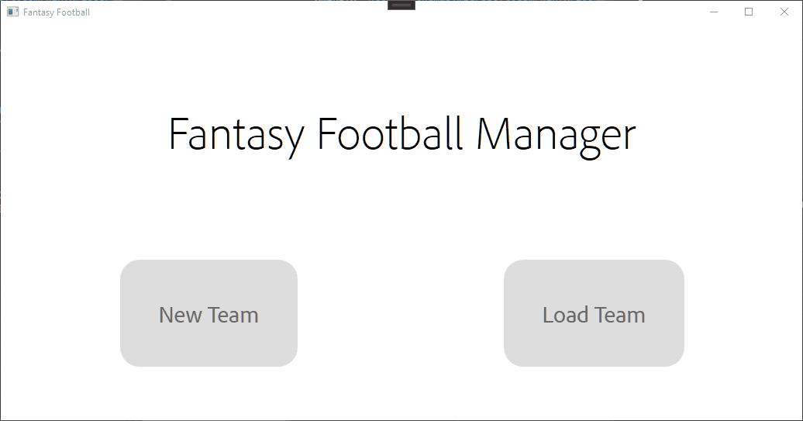

# Fantasy Football
WPF FantasyFootball application

## Instructions:
Write a program that allows users to create and store footballers 
for a fantasy football team with the following characteristics:
- Name
- Goals scored
- Number of Yellow Cards
- Number of Red Cards
      
A menu should be output that allows the user to enter a new player(max 5),
view their existing team, see the team's current value, or quit the program.
The team scores 10 points per goal, -5 for a red card and -2 for a yellow card.

When calculating the team's value, the stats of each player is read from
the file and the stored values are used to calculate the current value of the team.

## Brief Explanation of MVVM
If you are unfamiliar with the MVVM design pattern it stands for: **M**odel, **V**iew,
**V**iew**M**odel and it's main purpose it to decouple the user interface from any buisness logic
it does this by splitting the program into the model, view, and viewmodel. 

The view is created in xaml, which is essentially the html of the program.

The model holds the basic data, this is normally just a traditional c# class.

And the View models, these connect the views and modles, it turns the data from the model into properties that the view can show to the user.

For this project I used a MVVM framework to make everything easier: MvvmCross.

## Resources I used (in no particular order):
- [Asynchronous Programming - Tim Corey](https://www.youtube.com/watch?v=2moh18sh5p4)
- [MvvmCross basic tutorial - Tim Corey](https://www.youtube.com/watch?v=8E000zu8UhQ)
- [MvvmCross Documentation](https://www.mvvmcross.com/documentation/)
- [Basic XAML and WPF](https://wpf-tutorial.com/)
- [Validation in WPF](https://www.codeproject.com/Articles/15239/Validation-in-Windows-Presentation-Foundation)
- [Implementing CommonDialogs in MVVM](https://stackoverflow.com/a/64861760/14106896)
- [Expand Colapse with DataGrid](https://stackoverflow.com/questions/3829137/i-need-the-expand-collapse-for-rowdetailstemplate)
- [MvvmCross Sample Project](https://github.com/MvvmCross/MvvmCross-Samples/tree/master/StarWarsSample)
- [Disable button on validation error](https://stackoverflow.com/a/32810399/14106896)
